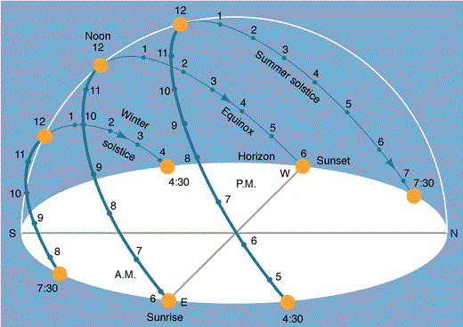

# Sun Path Diagram for any given location or latitude on earth

## Executive Summary

A Sun Path Diagram can help building environment designers gather information about how the sun will impact the building site throughout the year. It is used to determine the day of the year and hour of day when shading will take place at a location of interest. Below you can see a figure showing the sun path on three days of the year in the northern hemisphere. Going from right to left, three paths are shown, one being for the summer solstice, the next one for equinoxes and the last one for winter solstice. A Sun Path Diagram represents four parameters related to the position of the sun over a particular location and they are: hour, day, azimuth and altitude. 

*[Visualisation of a 3D Sun Path Diagram](http://friskykcollyer.blogspot.co.uk/2010/06/sun−path.html) \[Accessed 20 April 2016\]*

This program is designed to automatically draw a Sun Path Diagram for a location of interest, by inputting the location (the latitude of which is determined using the Google Maps API) or by inputting the latitude of the location of interest.

## Python Code Info
All code has been written in Python 2.7. In the code I have used matplotlib basemap toolkit, which is a library for plotting 2D data on maps in Python. Alghogh there was no need to printed data on maps, basemap toolkit proved to be usefuk to help transform coordinates to a different map projection. Then Matplotlib was used to plot the rest of the required data. The installation for the basemap toolkit can be found by clicking on this link: http://matplotlib.org/basemap/users/download.html \[Accessed 20 April 2016\].

Also Google Geodata API was used to determine the latitude of the location typed in by the user. The code takes the search string and constructs a URL as an encoded parameter and then uses urllib to retrieve the text from the Google geocoding API. The data received depends on the parameters sent and the geographical data stored in Google’s servers. When JSON data is retreived, it is parsed with the json library and a few checks are done, to make sure that data received is usable format and then the latitude coordinate is extracted for the purpose of the program.

The programming code asks the user for a location or a latitude, then calculates lists of altitudes and azimuths throughout the year. Once all the lists are complete, all the points are plotted on the Sun Path Diagram.
